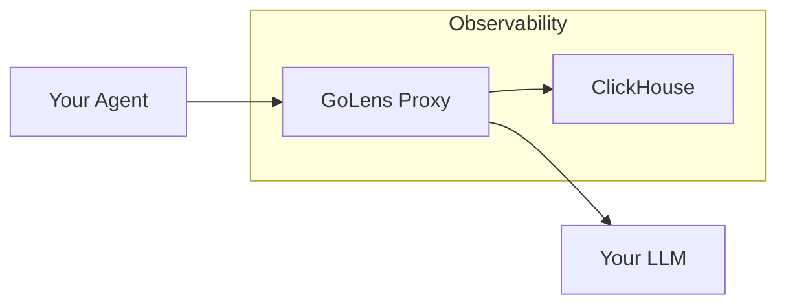

# golens

## Problem

When an Agent fails, is slow, or burns through $50 in an hour, we have no easy way to answer "Why?". Current solutions focus on manual instrumentation, forcing engineers to litter their business logic with SDK calls. Furthermore, most tools still store telemetry in three separate, unintegrated buckets (logs, metrics, and traces). But we need high-cardinality, wide events that capture the full context of every single interaction.

## Solution

GoLens is a reverse proxy that sits between your agent and your LLM of choice and captures events for every interaction without blocking the request stream. We are effectively building a wire tap between your agent and your LLM.

### Usage
1. Configure
```yaml
proxy:
    port: 8080
    target: "https://api.openai.com"

observability:
    backend: "stdout" # or "clickhouse", etc
```
2. Run/Deploy
3. Point your Agent to GoLens
```bash
export OPENAI_BASE_URL="http://localhost:8080/v1"
```

### Architecture


