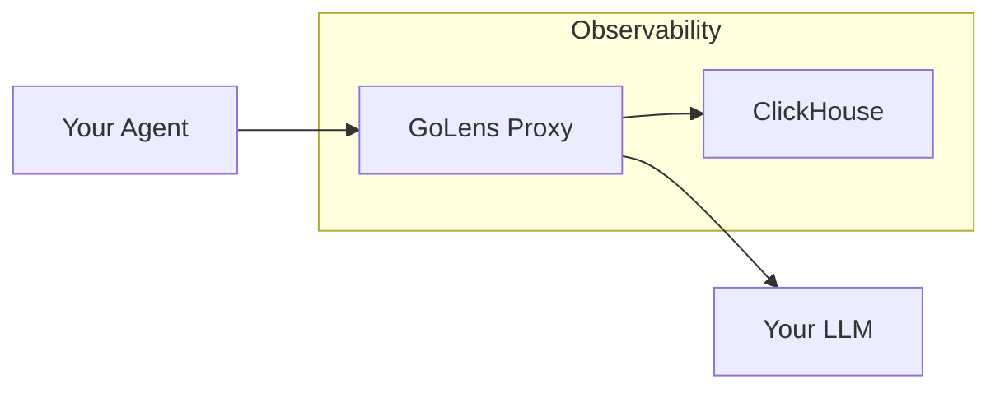

# golens

GoLens is a reverse proxy that sits between your agent and your LLM of choice and captures events for every interaction without blocking the request stream.

## Architecture



## Features

GoLens emits a single event for every interaction that includes:

* Request Context: Headers, User IDs, Model Params
* Performance: Duration, Time to First Token (TTFT)
* Cost: Token Costs
* Content: Full prompt (redaction capable)

## Usage

1. Configure
```yaml
proxy:
    port: 8080
    target: "https://api.openai.com"

observability:
    backend: "stdout" # or "clickhouse", etc
```
2. Run/Deploy
3. Point your Agent to GoLens
```bash
export OPENAI_BASE_URL="http://localhost:8080/v1"
```
